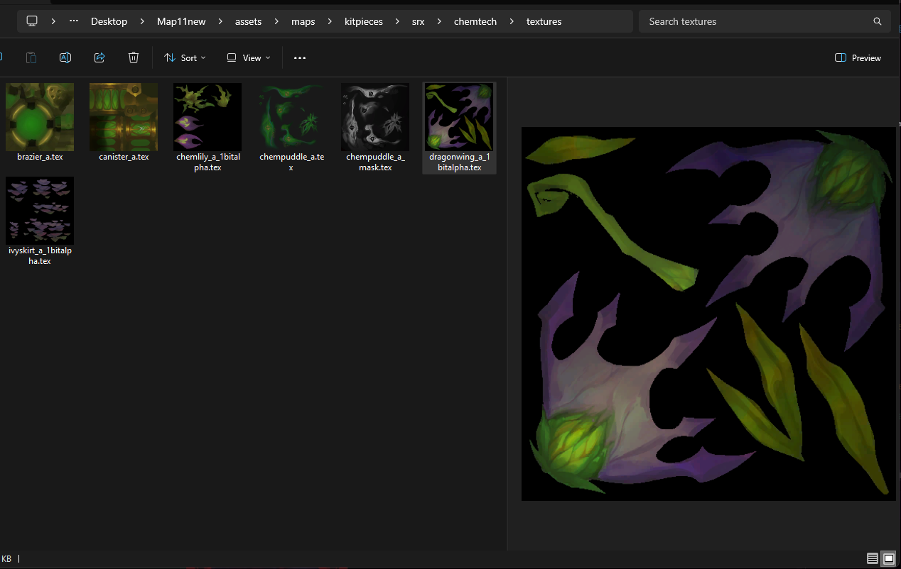

<div align="center">
  <a href="https://github.com/LeagueToolkit">
    
  </a>
  <h1>ltk-tex-utils</h1>
</div>

Small CLI utilities for working with League of Legends TEX textures, powered by `league-toolkit`.

### Features
- **Inspect TEX**: print format, dimensions, mipmaps, and resource type
- **Encode**: convert standard images (PNG/JPG/TGA/BMP/…) into `.tex`
- **Decode**: convert `.tex` back to common image formats (driven by output file extension)
- **Mipmaps**: optional generation with selectable filters
- **Windows Thumbnail Provider**: show `.tex` file previews directly in Windows Explorer

### Install

On Windows (recommended):

PowerShell (user scope):

```powershell
iwr -useb https://raw.githubusercontent.com/LeagueToolkit/ltk-tex-utils/main/scripts/install-windows.ps1 | iex
```

This downloads the latest release, installs it to `%LOCALAPPDATA%\LeagueToolkit\ltk-tex-utils`, adds a stable `bin` shim to your user `PATH`, and makes `ltk-tex-utils` available in new terminals.

### Windows Explorer Thumbnail Provider

On Windows, you can install a thumbnail provider that shows previews of `.tex` files directly in Windows Explorer.

<div align="center">
  
</div>

**Installation (requires administrator privileges):**

```powershell
# Run PowerShell as Administrator, then:
iwr -useb https://raw.githubusercontent.com/LeagueToolkit/ltk-tex-utils/main/scripts/install-thumbnail-handler.ps1 | iex
```

This will:
- Download the `ltk-tex-thumb-handler.dll` from the latest release
- Install it to `%ProgramFiles%\LeagueToolkit\ltk-tex-thumb-handler`
- Register the COM DLL with Windows Explorer

**Note:** You may need to restart Windows Explorer or your computer for thumbnails to appear.

**Uninstallation:**

To uninstall the thumbnail handler, run PowerShell as Administrator and execute:

```powershell
regsvr32.exe /u "%ProgramFiles%\LeagueToolkit\ltk-tex-thumb-handler\ltk_tex_thumb_handler.dll"
```

### Usage

Top-level help:

```bash
ltk-tex-utils --help
```

Subcommands:

#### info
Prints basic metadata about a TEX file.

```bash
ltk-tex-utils info -i path/to/texture.tex
```

Example output:

```
info: path/to/texture.tex
    format : Bc3
    dimensions : 1024x1024
    mipmaps : 10 (has_mipmaps: true)
    resource : Texture2D
```

#### encode
Encode an image into `.tex`.

```bash
ltk-tex-utils encode \
  path/to/input.png \
  -f <bc1|bc3|bgra8> \
  -m <true|false> \
  --mipmap-filter <nearest|triangle|catmullrom|lanczos3>
```

Notes:
- `-m/--generate-mipmaps` defaults to `true`. Pass `-m false` to disable mipmap generation.
- The input image is read via the `image` crate and supports common formats like PNG, JPEG, BMP, TIFF, TGA, etc.
- If `-o/--output` is not provided, output is written next to the input with the same name and a `.tex` extension.

Examples:

```bash
# BC3 with default mipmaps (triangle)
ltk-tex-utils encode albedo.png -f bc3

# Disable mipmaps
ltk-tex-utils encode icon.png -f bgra8 -m false

# BC1 with a different mipmap filter
ltk-tex-utils encode mask.png -f bc1 --mipmap-filter lanczos3
```

#### decode
Decode a `.tex` file into a standard image.

```bash
ltk-tex-utils decode path/to/input.tex
```

Notes:
- The output image format is inferred from the file extension (e.g., `.png`, `.jpg`, `.tiff`).
- Currently decodes the top-level mip (mip 0).
- If `-o/--output` is not provided, output is written next to the input with the same name and a `.png` extension.

### Supported formats and filters

- **Texture formats**: `bc1`, `bc3`, `bgra8`  
  (ETC1/ETC2 are not supported.)
- **Mipmap filters**: `nearest`, `triangle` (default), `catmullrom`, `lanczos3`

### Logging

The tool emits human-friendly logs. Informational, debug, and trace logs go to stdout; warnings and errors go to stderr.

### Development

Run from source:

```bash
cargo run -p ltk-tex-utils -- <subcommand> [options]
```

Examples:

```bash
cargo run -p ltk-tex-utils -- info -i samples/texture.tex
cargo run -p ltk-tex-utils -- encode samples/albedo.png -f bc3
cargo run -p ltk-tex-utils -- decode samples/texture.tex
```

### Acknowledgements

Built on top of `league-toolkit`'s texture APIs.


