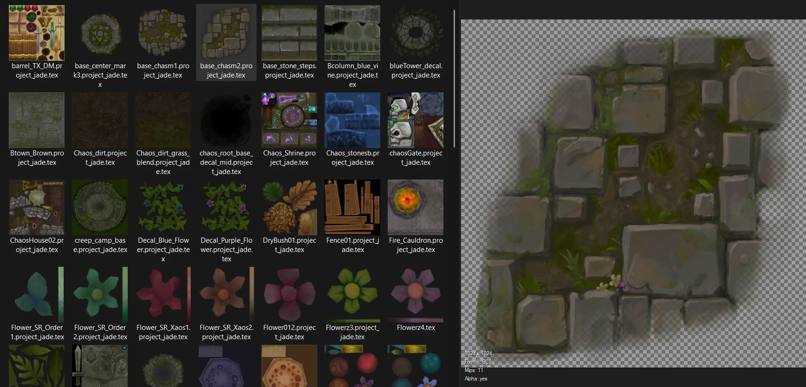
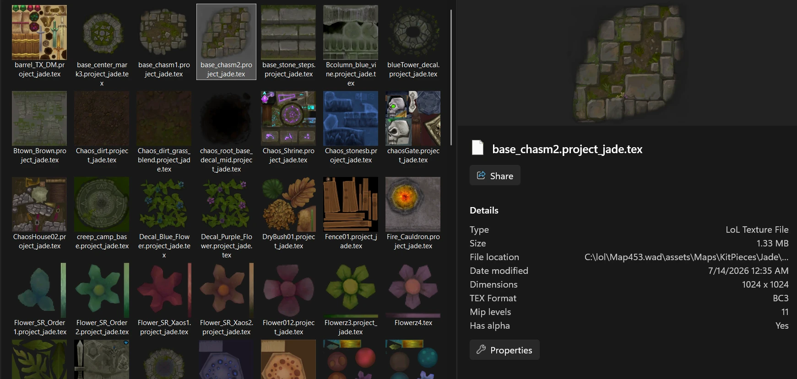
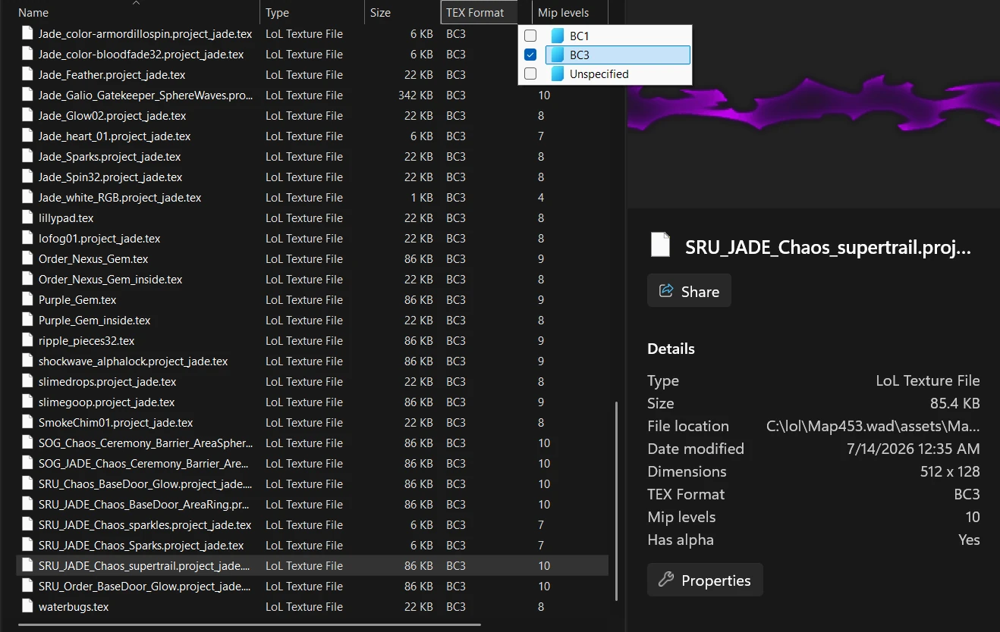
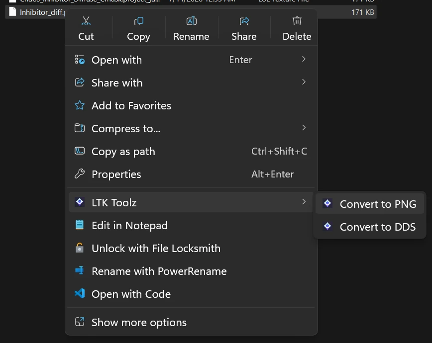
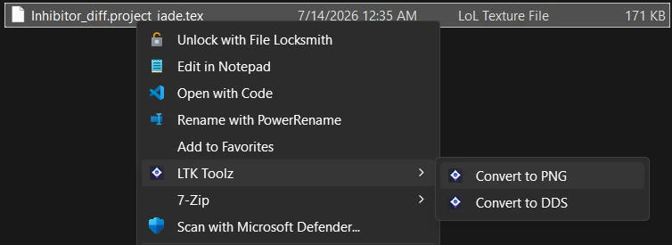
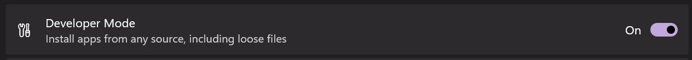

<div align="center">
  <a href="https://github.com/LeagueToolkit">
    
  </a>
  <h1>ltk-tex-utils</h1>
</div>

Command-line utilities for working with League of Legends `.tex` textures, powered by `league-toolkit`. Inspect, encode, and decode TEX files, with a **Windows Explorer integration enabling thumbnails, previews and custom context menu commands**.

<div align="center">

**[Installation](#installation)** · **[Context menu](#context-menu-right-click)** · **[Thumbnail handler](#thumbnail-provider)** · **[CLI commands](#cli-commands)**

</div>

## Installation

### Windows (Quick Install)

Run this in PowerShell (installs to a user-writable directory and updates `PATH`):

```powershell
iwr -useb https://raw.githubusercontent.com/LeagueToolkit/ltk-tex-utils/main/scripts/install-windows.ps1 | iex
```

This downloads the latest release (including the Explorer thumbnail-handler DLL), installs it to `%LOCALAPPDATA%\LeagueToolkit\ltk-tex-utils`, adds a stable `bin` shim to your user `PATH`, and makes `ltk-tex-utils` available in new terminals.

### From Releases

Download the latest release for your platform from the [Releases page](https://github.com/LeagueToolkit/ltk-tex-utils/releases).

### From Source

To build from source, you'll need:

- Rust (nightly toolchain)
- Cargo (Rust's package manager)

```bash
# Clone the repository
git clone https://github.com/LeagueToolkit/ltk-tex-utils.git
cd ltk-tex-utils

# Build the project
cargo build --release

# The binary will be available in target/release/
```

## Windows Explorer integration

On Windows, ltk-tex-utils can be driven straight from Explorer - no terminal required.

### Thumbnail provider

Install a shell extension that renders `.tex` previews directly in Windows Explorer: thumbnails in the file grid, a preview pane with an alpha checkerboard and a metadata overlay, and texture properties fed into Explorer's property system.

<div align="center">
  
  <p><em>Thumbnails and the preview pane — alpha checkerboard plus a dimensions/format/mips/alpha overlay.</em></p>
</div>

<div align="center">
  
  <p><em>The Details pane shows a texture's dimensions, TEX format, mip count, and whether it has alpha.</em></p>
</div>

<div align="center">
  
  <p><em><strong>TEX Format</strong> and <strong>Mip levels</strong> also work as regular Explorer columns — sortable, groupable, and filterable.</em></p>
</div>

The [quick install](#windows-quick-install) already downloads the handler DLL next to the
executable. Registration is machine-wide, so `handler install` copies the DLL to
`%ProgramFiles%\LeagueToolkit\ltk-tex-thumb-handler` and registers that copy - the
registration every account resolves never points into one user's profile. Install and
uninstall need administrator rights: from a normal terminal they request elevation (UAC)
and report back in the same terminal; an already-elevated terminal is used as-is.

```powershell
ltk-tex-utils handler install               # takes over .tex previews if another app owns them
ltk-tex-utils handler install --no-override # coexist; never take over
ltk-tex-utils handler status                # show registration state and mode
ltk-tex-utils handler uninstall             # unregister and restore any overridden association
```

**You may need to restart Windows Explorer (or your computer) for thumbnails to appear.**

(Installed via the old `install-thumbnail-handler.ps1` script? It used the same Program
Files directory, so the `handler` commands manage that copy in place.)

#### Coexisting with other `.tex` handlers

If another application already owns the `.tex` type - other tools (Photoshop, a
LaTeX editor) may claim it - `handler install` takes over its **thumbnail and
preview** slots so League previews win. It also removes competing `OpenWithProgids`
entries (e.g. VS Code's, which otherwise makes Explorer's Type column read
"LaTeX Source File" instead of "LoL Texture File"); those apps stay available in
the **Open with** menu. Everything is backed up and restored on uninstall, and
the double-click **"open"** association is never touched.

To opt out of the takeover, pass `--no-override`; the current owner's
thumbnail/preview/type name then keeps winning and ours stays out of the way.

### Context menu (right-click)

Register right-click context-menu entries for `.tex`, `.dds`, `.png` files and for folders. The entries are per-user, no admin rights are needed:

```powershell
ltk-tex-utils shell install
```

This adds an **LTK Toolz** menu with:

- `.tex` files: **Convert to PNG** / **Convert to DDS** (largest mip, written next to the file)
- `.dds` / `.png` files: **Convert to TEX** (BC3, mipmaps on - the safest defaults)
- Folders: **Convert all .tex to PNG** / **Convert all .tex to DDS** (recursive)

Multi-selection works too - each selected file is converted next to itself.

<div align="center">
  <table>
    <tr>
      <th>Windows 11 menu</th>
      <th>Classic menu</th>
    </tr>
    <tr>
      <td valign="top"></td>
      <td valign="top"></td>
    </tr>
  </table>
</div>

On **Windows 11** we always try installing into the modern context menu API since it also makes it show up in the classic shell. This comes some with a few caveats, mainly:
- **You must enable `Developer Mode` in Windows settings under: `System` > `Advanced`**

  

- **Why ?** - Windows 11 uses a new API for the modern context menu, which requires any application adding commands to it to be signed with a trusted code signing certificate, otherwise the OS refuses to display the menu as we expect. Our tool is currently **not signed** which means the only way to go around it is to enable Developer Mode in the OS settings.
- **What if I don't want to or can't enable it?** - *Fear not*, if we see that Developer Mode is toggled off, we can continue with installing the classic shell integration without any issues. It will show up when you click "Show more options". For those that want the classic shell, they can run `shell install --classic`
- **Windows 10** gets the classic shell by default

```powershell
ltk-tex-utils shell status     # show what is registered and where it points
ltk-tex-utils shell uninstall  # remove the entries
```

> **Note**: run `shell install` again after moving or updating the executable so the menu entries point at the new path (the quick-install script's stable `bin` shim avoids this).

### Drag-and-drop

Drag files (or folders) onto `ltk-tex-utils.exe` and they are converted next to the originals, no flags needed:

- A `.tex` file is decoded to a sibling `.png` (top mip).
- Any standard image (PNG/DDS/JPG/TGA/BMP/…) is encoded to a sibling `.tex` (BC3, mipmaps on).
- A folder is searched recursively for `.tex` files, which are decoded to sibling `.png`s.

## CLI commands

```bash
# Basic command structure
ltk-tex-utils <COMMAND> [OPTIONS]

# Show help / version
ltk-tex-utils --help
ltk-tex-utils <COMMAND> --help
ltk-tex-utils --version
```

Most commands accept inputs either via `-i/--input` or positionally, so `encode input.png` and `encode -i input.png` are equivalent. `encode` and `decode` accept any number of files and folders; folders are searched recursively for convertible files, and each output is written next to its input.

A global `--pause <never|on-error|always>` flag keeps the console window open before exiting - useful when the tool is launched from Explorer.

### Encode

Encodes standard images into `.tex`.

Common flags:

- `[INPUTS]...`: input images and/or folders (folders are searched recursively for `.png`/`.dds`); `-i/--input` also works
- `-o, --output <OUTPUT>`: output path, only valid with a single input (defaults to a sibling file with a `.tex` extension)
- `-f, --format <FORMAT>`: texture format - `bc1`, `bc3`, `bc7`, `bgra8`, `rgba16f`, `rgba32f` (default: `bc3`)
- `-m, --generate-mipmaps <true|false>`: generate mipmaps (default: `true`)
- `--mipmap-filter <FILTER>`: mipmap filter - `nearest`, `triangle`, `catmullrom`, `lanczos3` (default: `catmullrom`)
- `--weigh-color-by-alpha`: weigh color by alpha during the BC1/BC3 cluster fit - improves perceived quality for alpha-blended textures at the cost of color accuracy in transparent regions (ignored for other formats)

Input images are read via the [`image`](https://crates.io/crates/image) crate, so common formats like PNG, JPEG, BMP, TIFF, and TGA are supported. `.dds` inputs are decoded through `ltk_texture` (top mip), so block-compressed DDS files work too.

Basic examples:

```bash
# BC3 with default mipmaps (catmullrom filter)
ltk-tex-utils encode albedo.png -f bc3

# Positional input, explicit output path
ltk-tex-utils encode albedo.png -o out/albedo.tex

# Convert a DDS back to TEX with the default (safest) settings
ltk-tex-utils encode texture.dds

# Batch: multiple files and a whole folder in one go
ltk-tex-utils encode a.png b.dds textures/

# Disable mipmap generation
ltk-tex-utils encode icon.png -f bgra8 -m false

# BC1 with a different mipmap filter
ltk-tex-utils encode mask.png -f bc1 --mipmap-filter triangle

# Alpha-weighted BC3 for an alpha-blended texture
ltk-tex-utils encode decal.png -f bc3 --weigh-color-by-alpha
```

### Decode

Decodes `.tex` files into standard images. The output image format is inferred from the output file extension (or from `-f/--format` when no output is given).

Common flags:

- `[INPUTS]...`: input `.tex` files and/or folders (folders are searched recursively for `.tex`); `-i/--input` also works
- `-o, --output <OUTPUT>`: output path, only valid with a single input (parent directories are created as needed)
- `-f, --format <png|dds>`: output format when `-o` is not given (default: `png`); `dds` writes an uncompressed RGBA8 DDS of the decoded mip
- `-m, --mipmap <N>`: mip level to decode (default: `0`, the top mip)

Basic examples:

```bash
# Decode to a sibling texture.png
ltk-tex-utils decode texture.tex

# Decode to a sibling texture.dds (uncompressed RGBA8, top mip)
ltk-tex-utils decode texture.tex -f dds

# Decode to a specific path/format (inferred from the extension)
ltk-tex-utils decode -i texture.tex -o out/texture.tiff

# Decode a lower mip level
ltk-tex-utils decode texture.tex -m 2

# Batch: every .tex under a folder, PNGs written next to each file
ltk-tex-utils decode extracted-wad/
```

### Info

Prints basic metadata about a TEX file.

Common flags:

- `-i, --input <INPUT>`: path to the `.tex` file to inspect

```bash
ltk-tex-utils info -i path/to/texture.tex
```

Example output:

```text
info: path/to/texture.tex
    format : Bc3
    dimensions : 1024x1024
    mipmaps : 10 (has_mipmaps: true)
    resource : Texture2D
```

### Shell (Windows)

Manages the Explorer context-menu integration described [above](#context-menu-right-click):

```bash
ltk-tex-utils shell install
ltk-tex-utils shell status
ltk-tex-utils shell uninstall
```

### Handler (Windows)

Registers the `.tex` thumbnail/preview handler DLL described [above](#thumbnail-provider)
(elevates via UAC when the terminal isn't an administrator one):

```bash
ltk-tex-utils handler install               # takes over .tex previews if another app owns them
ltk-tex-utils handler install --no-override # coexist; never take over
ltk-tex-utils handler status
ltk-tex-utils handler uninstall
```

## Supported formats and filters

- **Encode formats**: `bc1`, `bc3`, `bc7`, `bgra8`, `rgba16f`, `rgba32f`
  - ETC1, ETC2, and BC5 are **not** supported for encoding.
- **Mipmap filters**: `nearest`, `triangle`, `catmullrom` (default), `lanczos3`

## Logging

The tool emits human-friendly logs. Informational, debug, and trace logs go to stdout; warnings and errors go to stderr.

## Development

Run from source with `cargo run`:

```bash
cargo run -p ltk-tex-utils -- <subcommand> [options]
```

Examples:

```bash
cargo run -p ltk-tex-utils -- info -i samples/texture.tex
cargo run -p ltk-tex-utils -- encode samples/albedo.png -f bc3
cargo run -p ltk-tex-utils -- decode samples/texture.tex
```

## Acknowledgments

- Built on top of [league-toolkit](https://github.com/LeagueToolkit)'s texture APIs.
