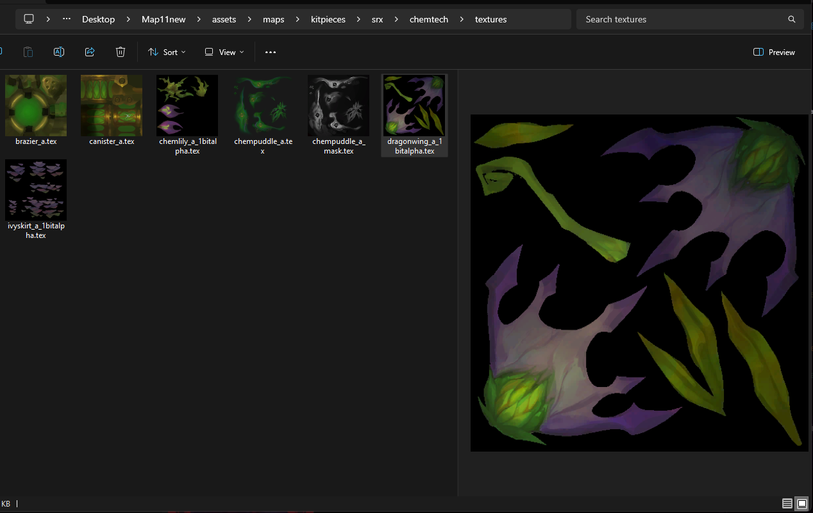

<div align="center">
  <a href="https://github.com/LeagueToolkit">
    
  </a>
  <h1>ltk-tex-utils</h1>
</div>

[](https://github.com/LeagueToolkit/ltk-tex-utils/actions/workflows/ci.yml)
[](https://github.com/LeagueToolkit/ltk-tex-utils/actions/workflows/release-plz.yml)

Command-line utilities for working with League of Legends `.tex` textures, powered by `league-toolkit`. Inspect, encode, and decode TEX files, with a Windows Explorer thumbnail provider for previewing them in place.

## Features

- **Info**: print a TEX file's format, dimensions, mipmap count, and resource type
- **Encode**: convert standard images (PNG/DDS/JPG/TGA/BMP/…) into `.tex`, with optional mipmap generation
- **Decode**: convert `.tex` back to common image formats, including DDS
- **Batch conversion**: pass multiple files or whole folders to `encode`/`decode`; outputs are written next to each input
- **Windows Explorer integration**: a thumbnail provider for `.tex` previews, right-click context-menu entries, and drag-and-drop onto the executable (see below)

## Installation

### Windows (Quick Install)

Run this in PowerShell (installs to a user-writable directory and updates `PATH`):

```powershell
iwr -useb https://raw.githubusercontent.com/LeagueToolkit/ltk-tex-utils/main/scripts/install-windows.ps1 | iex
```

This downloads the latest release, installs it to `%LOCALAPPDATA%\LeagueToolkit\ltk-tex-utils`, adds a stable `bin` shim to your user `PATH`, and makes `ltk-tex-utils` available in new terminals.

### From Releases

Download the latest release for your platform from the [Releases page](https://github.com/LeagueToolkit/ltk-tex-utils/releases).

### From Source

To build from source, you'll need:

- Rust (nightly toolchain)
- Cargo (Rust's package manager)

```bash
# Clone the repository
git clone https://github.com/LeagueToolkit/ltk-tex-utils.git
cd ltk-tex-utils

# Build the project
cargo build --release

# The binary will be available in target/release/
```

## Windows Explorer integration

On Windows, ltk-tex-utils can be driven straight from Explorer - no terminal required.

### Thumbnail provider

Install a shell extension that renders `.tex` previews directly in Windows Explorer.

<div align="center">
  
</div>

Run PowerShell **as Administrator**, then:

```powershell
iwr -useb https://raw.githubusercontent.com/LeagueToolkit/ltk-tex-utils/main/scripts/install-thumbnail-handler.ps1 | iex
```

This will:

- Download `ltk-tex-thumb-handler.dll` from the latest release
- Install it to `%ProgramFiles%\LeagueToolkit\ltk-tex-thumb-handler`
- Register the COM DLL with Windows Explorer

You may need to restart Windows Explorer (or your computer) for thumbnails to appear.

#### Coexisting with other `.tex` handlers

By default the handler registers at the extension level and **does not** take the
`.tex` type away from another application that already owns it. This is deliberate:
`.tex` is also the LaTeX source extension, and other tools (Photoshop, the RitoTex
plugin, RitoShark's provider) may already claim it. In the default mode, if one of
those already owns `.tex`, its thumbnail/preview wins and ours simply stays out of
the way.

If you *do* want League previews to win, pass `-Override` to the script (it will
otherwise prompt):

```powershell
iwr -useb https://raw.githubusercontent.com/LeagueToolkit/ltk-tex-utils/main/scripts/install-thumbnail-handler.ps1 | iex; # add -Override when running the script directly
```

Override mode takes over only the **thumbnail and preview** slots of whichever
application currently owns `.tex`, backing up the previous owner so uninstalling
restores it. The double-click **"open"** association (e.g. your LaTeX editor) is
left untouched.

#### Managing the handler from the CLI

If you already have `ltk-tex-utils` installed and the DLL present (next to the
executable, or in the default install directory above), you can register it from
an **elevated** terminal instead of the script:

```powershell
ltk-tex-utils handler install              # coexist (default)
ltk-tex-utils handler install --override   # take over .tex previews (prompts about LaTeX)
ltk-tex-utils handler status               # show registration state and mode
ltk-tex-utils handler uninstall            # unregister and restore any overridden association
```

To uninstall, use `ltk-tex-utils handler uninstall`, or run this in an Administrator
**Command Prompt** (it uses `cmd`-style `%ProgramFiles%` expansion):

```cmd
regsvr32.exe /u "%ProgramFiles%\LeagueToolkit\ltk-tex-thumb-handler\ltk_tex_thumb_handler.dll"
```

(`regsvr32 /u` also restores any association that override mode took over.)

### Context menu (right-click)

Register right-click context-menu entries for `.tex`, `.dds`, and `.png` files and for folders. The entries are per-user (`HKCU`), so no admin rights are needed:

```powershell
ltk-tex-utils shell install
```

This adds a cascading **ltk-tex-utils** menu with:

- `.tex` files: **Convert to PNG** / **Convert to DDS** (top mip, written next to the file)
- `.dds` / `.png` files: **Convert to TEX** (BC3, mipmaps on - the safest defaults)
- Folders: **Convert all .tex to PNG** / **Convert all .tex to DDS** (recursive)

Multi-selection works too - each selected file is converted next to itself.

```powershell
ltk-tex-utils shell status     # show what is registered and where it points
ltk-tex-utils shell uninstall  # remove the entries
```

> **Note**: run `shell install` again after moving or updating the executable so the menu entries point at the new path (the quick-install script's stable `bin` shim avoids this).

### Drag-and-drop

Drag files (or folders) onto `ltk-tex-utils.exe` and they are converted next to the originals, no flags needed:

- A `.tex` file is decoded to a sibling `.png` (top mip).
- Any standard image (PNG/DDS/JPG/TGA/BMP/…) is encoded to a sibling `.tex` (BC3, mipmaps on).
- A folder is searched recursively for `.tex` files, which are decoded to sibling `.png`s.

## Usage

```bash
# Basic command structure
ltk-tex-utils <COMMAND> [OPTIONS]

# Show help / version
ltk-tex-utils --help
ltk-tex-utils <COMMAND> --help
ltk-tex-utils --version
```

Most commands accept inputs either via `-i/--input` or positionally, so `encode input.png` and `encode -i input.png` are equivalent. `encode` and `decode` accept any number of files and folders; folders are searched recursively for convertible files, and each output is written next to its input.

A global `--pause <never|on-error|always>` flag keeps the console window open before exiting - useful when the tool is launched from Explorer.

### Info

Prints basic metadata about a TEX file.

Common flags:

- `-i, --input <INPUT>`: path to the `.tex` file to inspect

```bash
ltk-tex-utils info -i path/to/texture.tex
```

Example output:

```text
info: path/to/texture.tex
    format : Bc3
    dimensions : 1024x1024
    mipmaps : 10 (has_mipmaps: true)
    resource : Texture2D
```

### Encode

Encodes standard images into `.tex`.

Common flags:

- `[INPUTS]...`: input images and/or folders (folders are searched recursively for `.png`/`.dds`); `-i/--input` also works
- `-o, --output <OUTPUT>`: output path, only valid with a single input (defaults to a sibling file with a `.tex` extension)
- `-f, --format <FORMAT>`: texture format - `bc1`, `bc3`, `bc7`, `bgra8`, `rgba16f`, `rgba32f` (default: `bc3`)
- `-m, --generate-mipmaps <true|false>`: generate mipmaps (default: `true`)
- `--mipmap-filter <FILTER>`: mipmap filter - `nearest`, `triangle`, `catmullrom`, `lanczos3` (default: `catmullrom`)
- `--weigh-color-by-alpha`: weigh color by alpha during the BC1/BC3 cluster fit - improves perceived quality for alpha-blended textures at the cost of color accuracy in transparent regions (ignored for other formats)

Input images are read via the [`image`](https://crates.io/crates/image) crate, so common formats like PNG, JPEG, BMP, TIFF, and TGA are supported. `.dds` inputs are decoded through `ltk_texture` (top mip), so block-compressed DDS files work too.

Basic examples:

```bash
# BC3 with default mipmaps (catmullrom filter)
ltk-tex-utils encode albedo.png -f bc3

# Positional input, explicit output path
ltk-tex-utils encode albedo.png -o out/albedo.tex

# Convert a DDS back to TEX with the default (safest) settings
ltk-tex-utils encode texture.dds

# Batch: multiple files and a whole folder in one go
ltk-tex-utils encode a.png b.dds textures/

# Disable mipmap generation
ltk-tex-utils encode icon.png -f bgra8 -m false

# BC1 with a different mipmap filter
ltk-tex-utils encode mask.png -f bc1 --mipmap-filter triangle

# Alpha-weighted BC3 for an alpha-blended texture
ltk-tex-utils encode decal.png -f bc3 --weigh-color-by-alpha
```

### Decode

Decodes `.tex` files into standard images. The output image format is inferred from the output file extension (or from `-f/--format` when no output is given).

Common flags:

- `[INPUTS]...`: input `.tex` files and/or folders (folders are searched recursively for `.tex`); `-i/--input` also works
- `-o, --output <OUTPUT>`: output path, only valid with a single input (parent directories are created as needed)
- `-f, --format <png|dds>`: output format when `-o` is not given (default: `png`); `dds` writes an uncompressed RGBA8 DDS of the decoded mip
- `-m, --mipmap <N>`: mip level to decode (default: `0`, the top mip)

Basic examples:

```bash
# Decode to a sibling texture.png
ltk-tex-utils decode texture.tex

# Decode to a sibling texture.dds (uncompressed RGBA8, top mip)
ltk-tex-utils decode texture.tex -f dds

# Decode to a specific path/format (inferred from the extension)
ltk-tex-utils decode -i texture.tex -o out/texture.tiff

# Decode a lower mip level
ltk-tex-utils decode texture.tex -m 2

# Batch: every .tex under a folder, PNGs written next to each file
ltk-tex-utils decode extracted-wad/
```

### Shell (Windows)

Manages the Explorer context-menu integration described [above](#context-menu-right-click):

```bash
ltk-tex-utils shell install
ltk-tex-utils shell status
ltk-tex-utils shell uninstall
```

### Handler (Windows)

Registers the `.tex` thumbnail/preview handler DLL (requires an **elevated** terminal;
see [Coexisting with other `.tex` handlers](#coexisting-with-other-tex-handlers)):

```bash
ltk-tex-utils handler install              # coexist with any existing .tex owner (default)
ltk-tex-utils handler install --override   # take over .tex previews (prompts about LaTeX; --yes skips)
ltk-tex-utils handler status
ltk-tex-utils handler uninstall
```

## Supported formats and filters

- **Encode formats**: `bc1`, `bc3`, `bc7`, `bgra8`, `rgba16f`, `rgba32f`
  - ETC1, ETC2, and BC5 are **not** supported for encoding.
- **Mipmap filters**: `nearest`, `triangle`, `catmullrom` (default), `lanczos3`

## Logging

The tool emits human-friendly logs. Informational, debug, and trace logs go to stdout; warnings and errors go to stderr.

## Development

Run from source with `cargo run`:

```bash
cargo run -p ltk-tex-utils -- <subcommand> [options]
```

Examples:

```bash
cargo run -p ltk-tex-utils -- info -i samples/texture.tex
cargo run -p ltk-tex-utils -- encode samples/albedo.png -f bc3
cargo run -p ltk-tex-utils -- decode samples/texture.tex
```

## Acknowledgments

- Built on top of [league-toolkit](https://github.com/LeagueToolkit)'s texture APIs.
